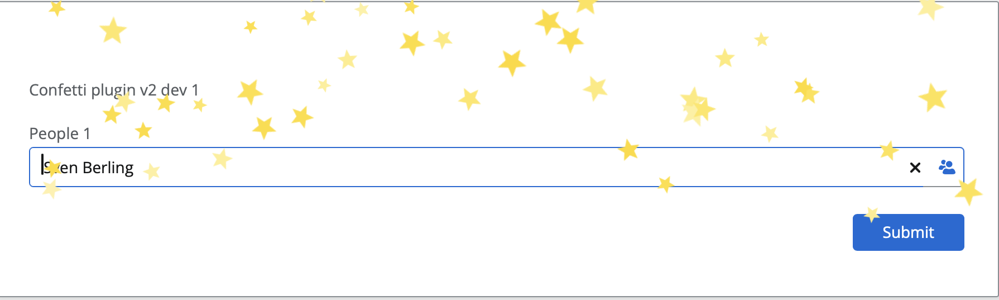
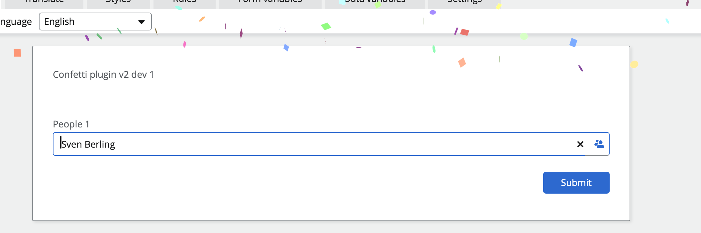
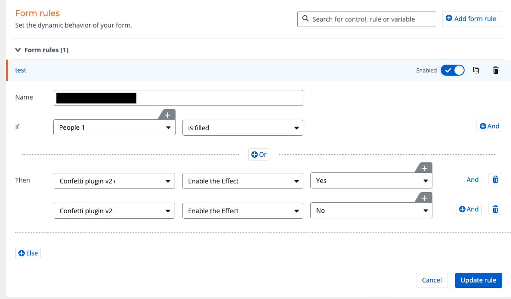

# Confetti Plugin

| Javascript Element Name | Version | Date       | Evaluation Link |
| ----------------------- | --------| ---------- | ----------------|
| confetti-form           | 2.1     | 2024-01-118| N/A             |

## Sparkle your Form

If you want to celebrate a form selection / a number or just typing text into a filed.
Now it is possible.

You can simple use this plugin to enable a confetti shower or a sparkle on your form via a rule.

### Example

 

You can use every control, the important configuration is, that you ne to enable the Effect and choose the correct plugin name.

> **Tip:** If you only want to enable the effect on time, just delete the last “Enable the Effect” rule under then, if you configure the rule like in the example. The Confetti or Sparkle will show every time.

> **Tip:** If you want to don’t want to show a Title on the form, you can leave the Title blank.